# Holloway's Upscaler - for Image and Video
[](https://github.com/hollowaykeanho/Upscaler)
This project is a consolidation of various compiled open-source AI image
upscaler products for a working CLI friendly image and video upscaling program.
It is configured to be ready for work right at the get-go.


## Why It Matters
For these reasons:

1. **I urgently need a video upscaling technologies to work locally** -
   for both image and video without any GUI overheads.
2. **Programmable** - when you want to upscale the an album or video, the AI
   program has to be programmable and not restricted by the GUI's design.
3. **Reliabily working on big subject** - larger video requires streaming
   approach to prevent the program from consuming too much resources from the
   system.


## Source Codes
This is a binaries assembled repository. You may find the source codes from the
original contributors here:

1. [Tencent's NCNN](https://github.com/Tencent/ncnn)
2. [Nihui](https://github.com/nihui)
3. [Xintao](https://github.com/xinntao)
4. [Upscayl (Nayam Amarshe & TGS963)](https://github.com/upscayl/upscayl/tree/main)

Sample video was supplied by
[Igrid North](https://www.pexels.com/video/the-sun-illuminating-earth-s-surface-1851190/)
from
[Pexels](https://www.pexels.com/).

Original 4k sized video is also available at source for upscaling comparison.


## License
This project is licensed under
[BSD-3-Clause "New or "Revised" License](LICENSE.txt).


## Supported Hardware
Here are the tested hardware and operating system:

| System             | Results     | Usable Processing Units |
|:-------------------|:------------|:------------------------|
| `debian-amd64` (linux) | `PASS`      | `NVIDIA GeForce MX150`, `Intel(R) UHD Graphics 620 (KBL GT2)` |
| `darwin-amd64` (macOS) | `FAILED`    | Binary failed to use `Intel Iris Graphics` iGPU and CPU. |
| `windows-amd64` (windows) | `TBD`    | **Help Needed** - either powershell support or BATCH translations. |

> **IMPORTANT NOTE**
>
> You seriously need a compatible GPU to drastically speed up the upscaling
> efforts **from hours to minutes**. I tested mine against
> `NVIDIA GeForce MX150` vs. `Intel(R) UHD Graphics 620 (KBL GT2)` built-in
> graphic hardwares on my laptop. It did a huge difference.

> **NOTE TO MacOS USERS**
>
> The binary `bin/mac-amd64` is currently unsigned. Hence, you need to explictly
> grant the use permission in your `Settings > Security & Privacy` section.
>
> Please be informed that my test result is in accordance with the Upscayl team:
> many CPU and iGPUs are not woking and supported yet.


### Dependencies
If you're working on video, you need `ffmpeg` and `ffprobe` for dissecting and
reassembling a video file.

You can proceed to install it at: https://ffmpeg.org/


## User Manual
Here are the basic user manuals:


### Install
To install, simply `git clone` the repository into an appropriate location and
symlink to your `$PATH` or `%PATH%` directory. Example, on `Debian Linux`:

```
$ git clone https://github.com/hollowaykeanho/Upscaler.git
$ ln -s /path/to/Upscaler/start.cmd /path/to/bin/upscaler
```

Alternatively, on UNIX (Linux & Mac) systems, you can create a shell script that
pass all arguments into the `start.cmd`. Example:

```
#!/bin/sh
/path/to/Upscaler/start.cmd "$@"
```

> TIP: if you decided to use the shell script approach, you can also design the
> command to use your default model and scaling for your programming
> efficiencies. Recommend you use `$HOME/bin` directory if it is set visible in
> your `$PATH` value.

> NOTE:
>
> Re-packaging efforts are unlikely because it's a bad investment. It's either
> I spend the time study NCNN implementations and write the whole XinTao's
> RealESRGAN-Vulcan program as my own codes or glued the existing programs
> together with POSIX compliant shell script. At the moment, I do not have the
> resources to rewrite or study the NCNN.


### Call for Help
This repository was unified using
[Holloway's Polygot Script](https://github.com/hollowaykeanho/PolygotScript) to
keep user instruction extremely simple. Hence, in any operating system (UNIX or
WINDOWS), simply interact with the repository's `start.cmd` script will do.
Example for, instruction on Linux or MacOS

```
$ ./Upscaler/start.cmd --help
```

In help display, you generally want to take notice of the `AVAILABLE MODELS`
list. The upscaling algorithms are solely based on the available models in the
[models](https://github.com/hollowaykeanho/Upscaler/tree/main/models) directory.
The scripts are written in a way to dynamically index each of them and present
it in the help display without re-writing itself.


### Upscale an Image
To upscale an image simple run `start.cmd` against the image:

```
$ ./start.cmd \
        --model ultrasharp \
        --scale 4 \
        --format webp \
        --input my-image.jpg
```

To determine the available models, their respective scale limits, and output
formats, simple execute the `--help` and look for: `AVAILABLE MODELS` and
`AVAILABLE FORMATS` respectively.

If done correctly, an image based on orginal filename with a suffix `-upscaled`
is created. If we follow the example above, it should be
`my-image-upscaled.webp`.


### Upscale a Video
Unless you're working on 8 seconds 8MB sized video, you would want to follow the
instructions below to make sure your video upscaling project are in tact and
resumeable.

#### (1) Budget Your Hardware Storage
Please keep in mind that **you need at least 3x video size storage** for
the job depending on the video frame rate, frame size, color schemes and etc.
The minimum 3x is due to:

1. 1 set is your original video.
2. 1 set is for all the upscaled images (can be lot bigger since we're doing it
   frame by frame losing the video compression effect).
3. 1 set is your output video (bigger than original of course).

Hence, please plan out your storage budget before starting a video upscale
project.

> **IMPORTANT**
>
> **Know your hardware limitations** before determining the scaling factor. A
> scale of 4x on a 1090p for a 16GB memory laptop can crash the entire OS during
> video re-assembly phase due to memory starvation.

#### (2) Setup Project Directory
You're advised to create a project directory for upscaling video project due to
its large sized data.

Instead of executing the `start.cmd` straight away, please script it inside and
place it in a project directory. A simple example would be:

```
#!/bin/sh
/path/to/Upscaler/start.cmd --model ultrasharp \
	--scale 4 \
	--input ./sample-vid.mp4 \
	--video
```

This is for resuming the upscaling project in case of crashes or long hours
work. A good directory looks something as follows:

```
/path/to/my-upscaled-project/
├── run.sh
└── sample-vid.mp4
```

#### (3) Run The Initator Script
To initiate or to resume project, simply run your initiated project:

```
# cd /path/to/my-upscaled-project
$ ./run.sh
```

The Upscaler will create a workspace to house its output frames and control
values.

#### (4) Resetting the Project [IN CASE]
Just in case if you bump into something odd that requires to restart the project
from start, you can delete the `-workspace` directory inside the project to
restart all over again.

The project intentionally left the workspace as it is for those who want to
do frame extractions for other purposes (e.g. thumbnail).


## Helping The Project
Star, Watch, or the best: **sponsor the contributors**.


### Contribute Back
In case you need to contribute back:

1. Raise an [issue ticket](https://github.com/hollowaykeanho/Upscaler/issues).
2. Fork the repository and work against the `main` branch.
3. Develop your contributions and ensure your commit are GPG-signed.
4. Once done, **DO NOT raise a pull request**. Simply notify me via your ticket
   and I will clone your forked repo locally and `cherry-pick` them (I want
   those GPG signatures preserved where GitHub Pull Request cannot fulfill).
5. Delete your fork repo once I notify you that the merging is completed.
6. Thank you.


## Benchmarks
Results of benchmarks running `tests/benchmark.sh` at the root of the
repository. Please leave the system dedicated to only running the benchmark
and not doing something else for maintaining consistencies.

### Debian AMD64 CPU, 12GB Memory, 2GB VRAM, NVIDIA GeForce MX150

| Version     | Sample 1 (Video)                                           |
|:------------|:-----------------------------------------------------------|
|`v0.4.0`     | `(real) 171m56.165s (user) 257m51.602s (sys) 19m24.107s`   |
|`v0.3.0`     | `TBD`   |
|`v0.2.0`     | `TBD`   |
|`v0.1.0`     | `TBD`   |
